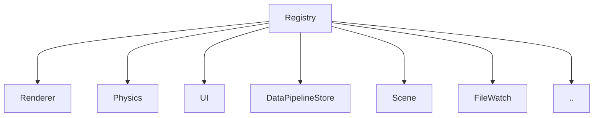
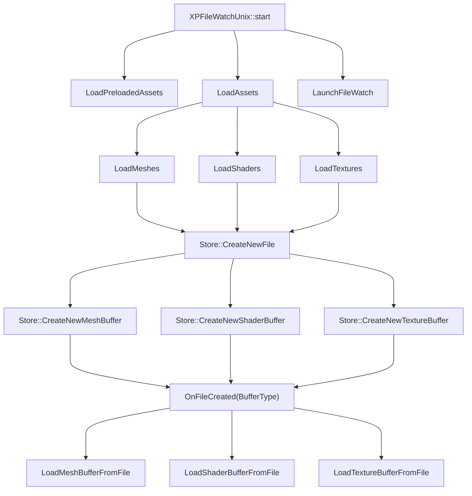
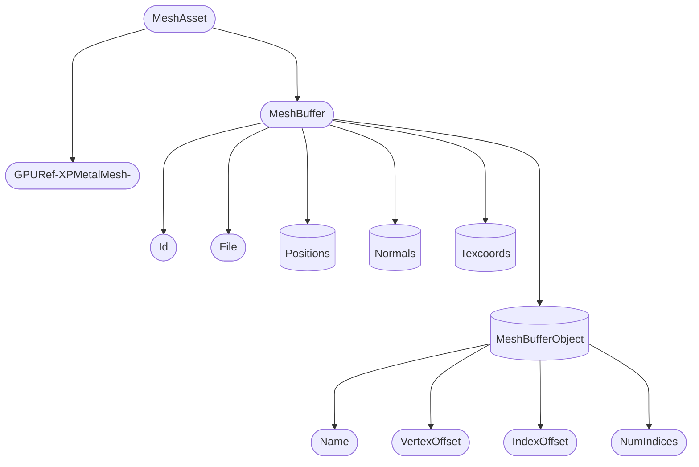
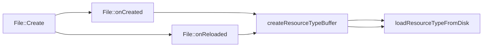

# Architecture

The core structure that binds everything together is the `Registry` class. \
This class holds all instances used by the engine and it is configured at engine startup. \
The closest design pattern to this is the `dependency injection pattern`. \
Mainly I check the definitions coming from `CMAKE` on which backends to be used then I create instances for each subsystem accordingly. \
Once I load all instances I then launch the engine loop. \
The registry does not expect much changes of these instances on runtime, but in theory you can change them. \
So for example you can decide to switch from `Vulkan` to `Metal` mid the runtime of the engine. \
In theory as well with small changes you can run both `Vulkan` and `Metal` side by side to check rendering missmatches, but more on that later ..  

---
 
 
 

# Data Pipeline
The 0xP engine loads assets fom disk then transforms the information into structures to then be consumed by the different subsystems. \
Also because the engine is having builtin hot-reload for almost all assets loaded from disk, it keeps track of filesystem changes related to the loaded assets.
This then allows you to press the button next to the play button in the editor to apply the changes immediately and do the hot-reload ..

For example loading a 3D model "cube.obj" from disk is then transformed into an `XPMeshAsset` and `XPMeshBuffer` to then be consumed by the `Renderer` to upload the [vertices, normals, ..] into the gpu buffers ..
For more on that, check the source code at `src/DataPipeline/`

Here's also some drawings to help you out understanding how it works.

 
 
 
 
 
 
 

# Mesh Hierarchy

 
 
 
 
 
 
 

# File And Resources Creation pipeline

 
 
 
 
 

