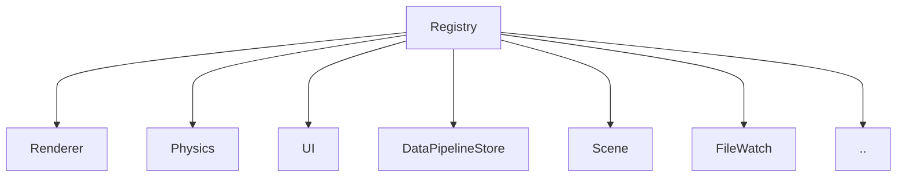
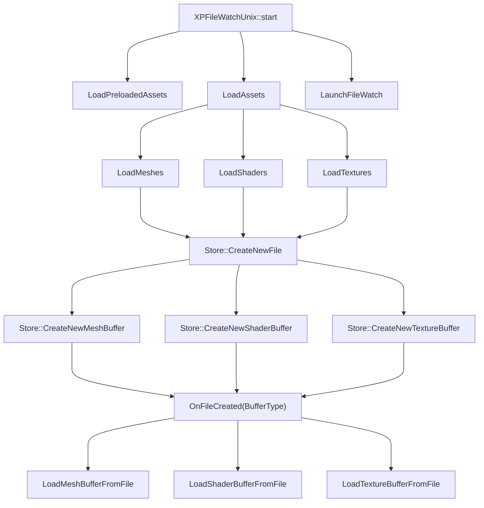
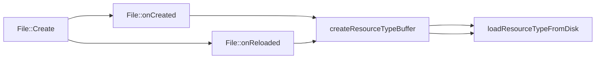

# Architecture

The core structure that binds everything together is the `Registry` class. \
This class holds all instances used by the engine and it is configured at engine startup. \
The closest design pattern to this is the `dependency injection pattern`. \
Mainly I check the definitions coming from `CMAKE` on which backends to be used then I create instances for each subsystem accordingly. \
Once I load all instances I then launch the engine loop. \
The registry does not expect much changes of these instances on runtime, but in theory you can change them. \
So for example you can decide to switch from `Vulkan` to `Metal` mid the runtime of the engine. \
In theory as well with small changes you can run both `Vulkan` and `Metal` side by side to check rendering missmatches, but more on that later ..  

---
 
 
 

# Data Pipeline
The 0xP engine loads assets fom disk then transforms the information into structures to then be consumed by the different subsystems. \
Also because the engine is having builtin hot-reload for almost all assets loaded from disk, it keeps track of filesystem changes related to the loaded assets.
This then allows you to press the button next to the play button in the editor to apply the changes immediately and do the hot-reload ..

For example loading a 3D model "cube.obj" from disk is then transformed into an `XPMeshAsset` and `XPMeshBuffer` to then be consumed by the `Renderer` to upload the [vertices, normals, ..] into the gpu buffers ..
For more on that, check the source code at `src/DataPipeline/`

Here's also some drawings to help you out understanding how it works.

 
 
 
 
 
 
 

# Mesh Hierarchy

 
 
 
 
 
 
 

# File And Resources Creation pipeline

 
 
 
 
 

# RISC-V Emulation
There are multiple locations where you can see riscv emulation related code. \
Originally, I was planning to run RiscV emulator on CPU only, then I decided to add the ability to run same Code on GPU. \
To see the RISC-V emulation code that runs on the CPU see `src/Emulator/`.\
To see the RISC-V emulation code that runs on the GPU see `src/Compute/`.

The main goal there is to run `RV32im` elf binaries on both the `CPU` or the `GPU`.

First thing is first, you need to have a C/C++ compiler that compiles for the riscv target (RV32IM).
So you need to go to `src/Emulator/`, then run `./setup.sh`
(if you're on Windows, use WSL, also make sure the setup.sh is set as `LF instead of CRLF` !!). \
This should clone the riscv-gcc repository then builds the compiler for us. \
Then run `./build.sh` to build the example programs that you can find under `src/Emulator/test/`. \
The `rasterizer32` is actually one of those test programs that will be built there. \
After building the test programs, you should see these files:
- `src/Emulator/test/build/Debug/rasterizer32`
- `src/Emulator/test/build/Debug/rasterizer32.bin`
- `src/Emulator/test/build/Debug/rasterizer32.lst`

You can open `rasterizer32.lst` to read the assembly code there if you want (for debugging later).

Now let's talk about the emulator side.

# Emulator on CPU
- Written in C, source code found under `src/Emulator/src/` and `/src/Emulator/include/`
- It is used from the editor to execute the test programs we previously compiled above. 

# Emulator on GPU
- Written in Slang, it is ran as a compute shader. It runs same RISC-V programs compiled and ran via the emulator running on the CPU.
- As you might tell, running on the emulator on the GPU comes with some assumptions as we don't have access to filesystem for example there ... So you will see slight difference in the emulator code for both cases.
- For rasterizer32, it is assumed that we divide the framebuffer into tiles, each tile is handled by a riscv core. For example 1920x1080 final render target, say we have 120x120 tile, so we end up having 144 tiles, 144 threads (RiscV cores) emulated and ran in as a compute shader.
- There's no optimizations whatsoever there as you might tell :))
- The emulator is written very simple and direct. Fetch, decode, execute .. :))
- No fancy branch predictions or anything that might accelerate the process.
- Also the GPU is not simply a CPU with more threads ... Long story short, performance is not great there of course, I know, there are huge room for optimizations, later ..

# Editor
Before you go down to running riscv programs from the editor, make sure you have compiled the test riscv programs. The editor expects you to place all compiled riscv binaries under `/build/<debug|Release>/riscv/`. So when you type `rasterizer32` in the textfield, it actually loads `/build/<Debug|Release>/riscv/rasterizer32`

In order to run rasterizer on RISC-V emulator, simply open the `Emulator` tab in the editor, then select any object in the scene from the `Hierarchy tab on the left`, after you click one object, on the right you will see a tab called `Traits`, right click there and click `Script` to add a new `Script` component or trait to that object. \
The script is mainly the 32-bit riscv program that you're to then load and running it. \
Now under script, you'll see a text field for `program`, simply type the name of the 32-bit riscv program you would like to run then click on the small download button to load the elf binary and then press the play button to run the code. 