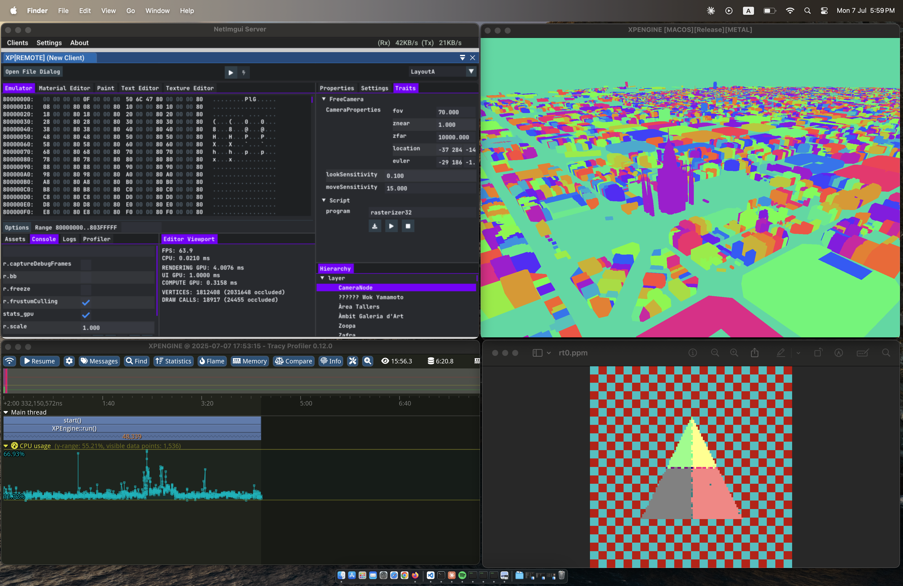
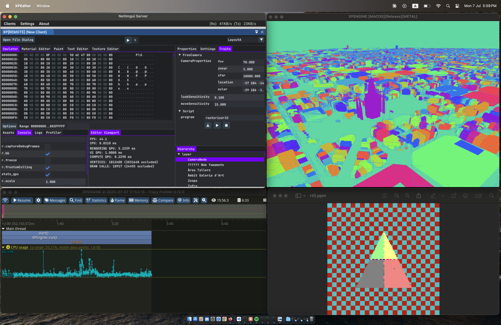
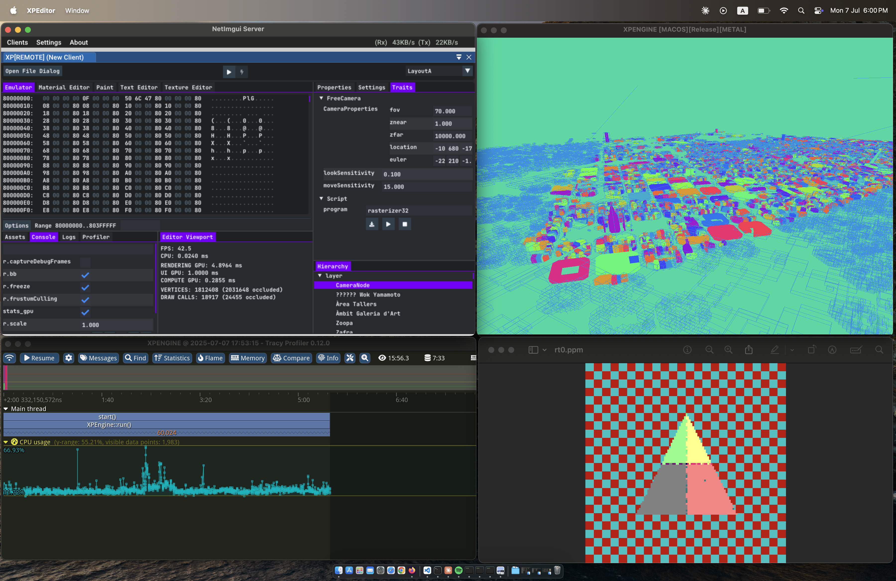
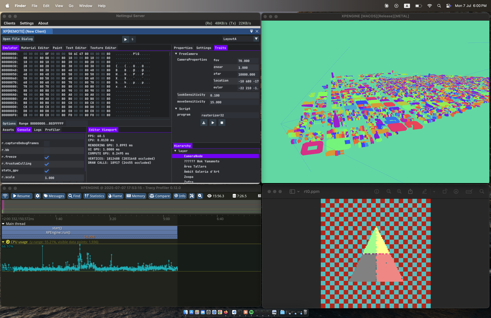

# 0xP
0xP is based on my slightly older [Prototype Engine](https://github.com/o-micron/Prototype) \
0xP  is my personal experimental engine. developed for experimentation only. \
This is mainly used to try new ideas, it offers more flexibility than performance. \
This is also a trimmed down version of the engine. Lots of commented out code or code that is trimmed etc ..

# Support
- MacOS
- Windows
- Linux
- Web assembly

# Play around with the engine
- First make sure you have installed `Xcode` (MacOs), `Visual Studio` (Windows), `GCC` (Linux). \
- 0xP is built with a custom modified version of LLVM/CLANG, but you still need to get the tools above. \
- It's also expected that you have Python3 installed on your system .. \
- If you have any installation or build issues create an issue for that. \
- I am on MacOS/Windows and I am not 100% sure everything builds flawlessly on Linux.

- Clone the repository `git clone https://github.com/o-micron/0xP.git`
- Download thirdparty (artifacts) via running `download_artifacts.sh` (MacOS | Linux), `download_artifacts.bat` (Windows) \
  For the download script to run correctly you need to have [github cli](https://cli.github.com/) installed, it basically fetches binaries from releases from [0xTP](https://github.com/o-micron/0xTP/releases/tag/v0.0.1), you can download them all manually instead if you want
- Build everything via running `build.sh` (MacOS | Linux), `build.bat` (Windows)
- Run the engine `run_engine.sh` (MacOS | Linux), `run_engine.bat` (Windows)
- Run the editor `run_editor.sh` (MacOS | Linux), `run_editor.bat` (Windows)
- Run the tracy profiler if you want as well via running `launch_tracy.sh` (MacOS | Linux), `launch_tracy.bat` (Windows)

# Architecture of the engine
For more detailed readme about the design of the engine and how to configure/select or extend/build pieces of the engine see [ARCHITECTURE](https://github.com/o-micron/0xP/blob/main/ARCHITECTURE.md)

# Screenshots

  
  
  
  

# Todo status
|✅|🚧|📋|⏸️|🛑|
|:--:|:--:|:--:|:--:|:--:|
|Done|In Progress|planned and ready to start|Not planned and needs more time|Not Planned, not scheduled or deprioritized|

|                                                 | MacOS | Linux | Windows | Web |
|-----------------------------------------------------------|:-----:|:-----:|:-------:|:---:|
| **Current needed improvements and Issues**      |🚧|🚧|🚧|🚧|
| UI and Editor general bug fixing                                            |📋|📋|📋|📋|
| Put Scene Description on GPU and fix bugs                                   |📋|📋|📋|📋|
| **Editor integration**                          |✅|✅|✅|✅|
| **Tracy Profiler integration**                  |✅|✅|✅|✅|
| **Custom SW Rasterizer Subsystem**                     |||||
| Rasterizer                                                                  |✅|✅|✅|✅|
| Raytraced Shadows only                                                      |✅|✅|✅|🚧|
| Full Raytracing                                                             |✅|✅|✅|🚧|
| Divide rasterization workloads on threads                                   |📋|📋|📋|📋|
| Use tiled architecture instead (tile partitioning)                          |📋|📋|📋|📋|
| Early depth workaround for supporting transparency and blending             |📋|📋|📋|📋|
| Optimize computations with SIMD                                             |📋|📋|📋|📋|
| GPU Compute Shader Based (CUDA)                                             |🛑|📋|📋|🛑|
| GPU Compute Shader Based (Metal Compute)                                    |📋|🛑|🛑|🛑|
| **GPU Rendering Subsystem**          |Metal|Vulkan|Dx12|WEBGPU|
| RHI                                                                         |⏸️|⏸️|⏸️|⏸️|
| debugging                                |Xcode tools|RenderDoc|Nvidia Nsights GFX/COMPUTE|WGPU Inspector|
| Object Selection from Scene (for editor)                                    |✅|🚧|🛑|📋|
| GPU commands execution timing                                               |✅|🚧|🛑|📋|
| GPU compute based frustum culling                                           |✅|📋|🛑|📋|
| Visualise bounding boxes                                                    |✅|📋|🛑|📋|
| Visualise frustum culling with freeze                                       |✅|📋|🛑|📋|
| Shader reflection system                                                    |📋|✅|🛑|📋|
| Shader specialization                                                       |📋|📋|📋|📋|
| Unified Shading language across all APIs (Slang)                            |📋|📋|📋|📋|
| Node based material system                                                  |📋|📋|📋|📋|
| Upscaling                                                                   |⏸️|⏸️|⏸️|⏸️|
| Physically based rendering                                                  |⏸️|⏸️|⏸️|⏸️|
| Raytracing (GI/Shadows)                                                     |📋|📋|🛑|📋|
| GPU driven architecture                                                     |📋|📋|🛑|🛑|
| MeshShaders experiments                                                     |📋|📋|📋|🛑|
| Workgraph experiments                                                       |🛑|📋|📋|🛑|
| **Neural Rendering**                            |📋|📋|📋|📋|
| **Physics Subsystem**                                     |||||
| Jolt                                                                        |✅|✅|✅|🚧|
| Nvidia's PhysX 4                                                            |📋|📋|📋|📋|
| Nvidia's PhysX 5                                                            |⏸️|📋|📋|⏸️|
| Bullet Physics                                                              |🛑|🛑|🛑|🛑|
| **Data Pipeline Subsystem**                               |||||
| File Watch                                                                  |✅|✅|✅|⏸️|
| Hot Reload                                                                  |✅|🚧|⏸️|⏸️|
| **Emulator Subsystem**                                    |||||
| Platform Risc-V toolchain ready to build examples                           |✅|✅|🛑|🛑|
| Core Emulator                                                               |✅|✅|✅|✅|
| **UI Subsystem**                                          |||||
| Remote UI                                                                   |✅|✅|✅|📋|
| Realtime modification of UI themes                                          |✅|✅|✅|✅|
| Adding more elegant design and layout (glass?)                              |📋|📋|📋|📋|
| **AI/MCPServer Subsystem**                                |||||
| Controlling Actor/Entities creation/destruction and configuration           |🚧|🚧|🚧|🚧|
| **Scene Description Subsystem**                           |||||
| Use attachments to describe components data                                 |✅|✅|✅|✅|
| Allow LLVM/Clang based code generation for scene description system         |✅|✅|✅|✅|
| Allow LLVM/Clang based UI code generation for attachments                   |✅|✅|✅|✅|
| Allow LLVM/Clang based new function interfaces                              |✅|✅|✅|✅|
| Add support for secondary attachments                                       |✅|✅|✅|✅|
| Add support for attachments members for unions and bitfields                |📋|📋|📋|📋|
| **Scripting Subsystem**                                   |||||
| LUA                                                                         |✅|✅|✅|✅|
| Rust                                                                        |✅|✅|✅|🛑|
| C                                                                           |✅|✅|✅|🛑|
| C++                                                                         |✅|✅|✅|🛑|
| **Web based engine and editor**                           |||||
| WebGPU                                                                      |🛑|🛑|🛑|✅|
| Use Wasm SIMD intrinsics                                                    |🛑|🛑|🛑|📋|
| Wasm64 experimental                                                         |🛑|🛑|🛑|📋|

# LICENSE
See [LICENSE](LICENSE)
